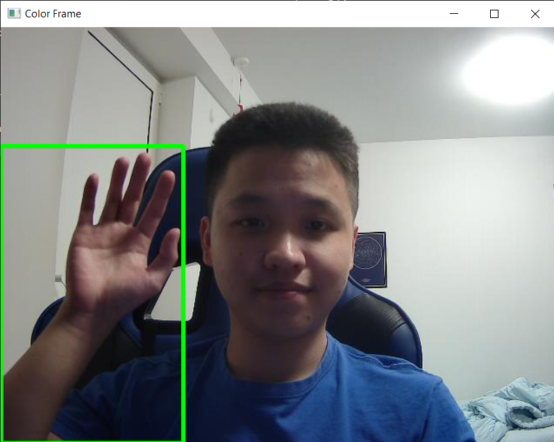
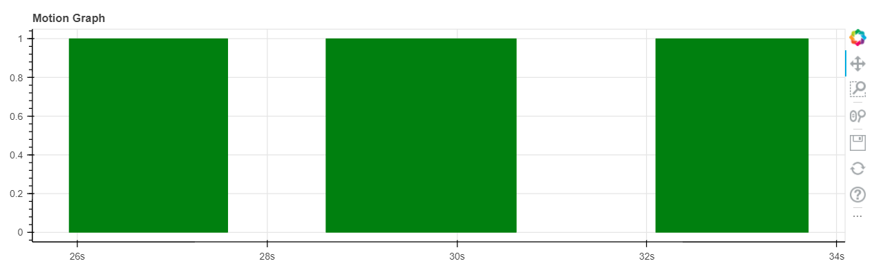

# Project Scope
The purpose of this project is to further solidify my knowledge on video processing using Computer Vision and interactive visualisation using Bokeh.

# Project Methodology 
1. Check if the camera works, when camera turns on it captures the first frame as reference 
2. Refreshes frame every 1 ms
3. Creates a Gray Frame and makes frame blury to make it insensitive to small changes 
4. Creates a Delta Frame which calculates the difference in first frame and all following frame 
5. Creates a Thershold Frame which determines when the difference in first frame and following frame is more than 30 using cv2.THRESH_BINARY 

6. For every changes it detects, creates a green rectangular using cv2.rectangle 
7. Tracks every changes in motion from Threshold Frame, plot a barchart using Bokeh 
8. Press q to exit 

# Project Respository Files
## Capture.py
A python file consisting the codes for video processing
## Graph1.html
An HTML file consisting the code needed to load Bokeh Graph to browser
## Plotting.py
A ptython file consisting the codes for data visualisation
## Times.csv
A CSV file that tracks the start and end time when motion is detected
